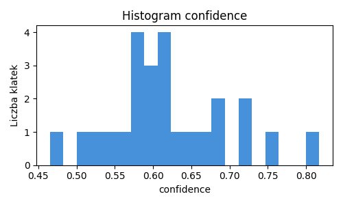
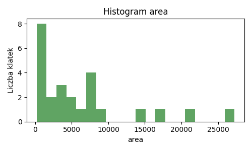
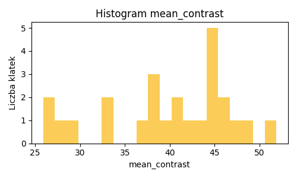
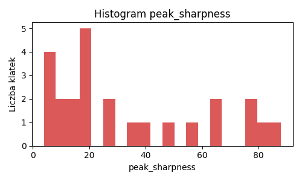
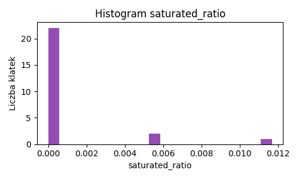
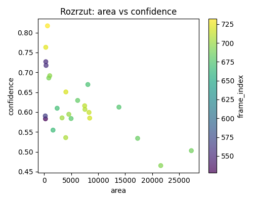

# Raport kalibracji percepcji

## Metadane uruchomienia

- Data UTC: 2026-04-17T15:15:36.380204+00:00
- Input video: `C:\Users\matpo\repo\alf-light-tracking\ros2_ws\g1_light_tracking\tools\video.mp4`
- Input frame count: **734**
- Sampled frames: **734**
- Analyzed frames: **245**
- Status kalibracji: **✅ wiarygodna**
- Powód odrzucenia: **brak**
- Fallback do domyślnych: **nie**
- Powód fallbacku: **brak**
- Detection ratio: **0.102** (25/245)
- Mediana confidence: **0.607**
- Mediana score_proxy: **0.592**

## Wykresy z kalibracji

## Zmiany parametrów względem domyślnych

| Parametr | Wartość domyślna | Nowa wartość | Δ (różnica) | Siła zmiany [%] | Skutek zmiany |
|---|---:|---:|:---:|:---:|---|
| `min_detection_confidence` | `0.0000` | `0.5380` | +0.5380 | 53.8 | Obniżenie progu zwiększa liczbę wykrywanych obiektów, ale może zwiększyć liczbę fałszywych detekcji. |
| `min_detection_score` | `0.0000` | `0.5407` | +0.5407 | 54.1 | Obniżenie progu pozwala na akceptację słabszych sygnałów, co zwiększa czułość, ale może obniżyć precyzję. |
| `min_area` | `10.0000` | `299.0000` | +289.0000 | 28.9 | Zmniejszenie minimalnego obszaru pozwala wykrywać mniejsze plamki, ale zwiększa ryzyko szumu. |
| `min_mean_contrast` | `4.0000` | `30.5020` | +26.5020 | 10.4 | Obniżenie progu pozwala wykrywać obiekty w słabszym kontraście, ale zwiększa podatność na tło. |
| `min_peak_sharpness` | `6.0000` | `12.3000` | +6.3000 | 2.5 | Obniżenie progu pozwala wykrywać mniej ostre plamki, ale może zwiększyć liczbę fałszywych detekcji. |
| `max_saturated_ratio` | `0.3500` | `0.0003` | -0.3497 | 35.0 | Podwyższenie limitu pozwala akceptować bardziej nasycone obiekty, co może być potrzebne przy silnym oświetleniu. |

## Parametry i reguły wyliczenia

*Poniższe progi zostały wyznaczone z uwzględnieniem rzeczywistych warunków nagrania kalibracyjnego, które mogą odbiegać od warunków laboratoryjnych.*

| Parameter | Value | Source metric | Reguła wyliczenia |
|---|---:|---|---|
| `min_detection_confidence` | `0.5380` | `confidence` | P10 z 23 próbek confidence |
| `min_detection_score` | `0.5407` | `score_proxy` | P10 z 23 próbek score_proxy |
| `min_area` | `299.0000` | `area` | P10 z 21 próbek area po filtracji IQR |
| `min_mean_contrast` | `30.5020` | `mean_contrast` | P15 z 23 próbek mean_contrast po filtracji IQR |
| `min_peak_sharpness` | `12.3000` | `peak_sharpness` | P15 z 23 próbek peak_sharpness po filtracji IQR |
| `max_saturated_ratio` | `0.0003` | `saturated_ratio` | P90 z 20 próbek saturated_ratio po filtracji IQR |

## Wagi confidence (znormalizowane do sumy 1.0)

| Parameter | Value | Source metric | Reguła wyliczenia |
|---|---:|---|---|
| `confidence_weight_shape` | `0.3200` | `scene_statistics` | Saturacja jest umiarkowana, więc większy nacisk można położyć na metryki fotometryczne. |
| `confidence_weight_brightness` | `0.2200` | `scene_statistics` | Jasność opisuje siłę sygnału, ale nie może dominować nad geometrią plamki. |
| `confidence_weight_contrast` | `0.2400` | `scene_statistics` | Kontrast jest stabilny, więc wagi kontrastu i ostrości pozostają zbalansowane. |
| `confidence_weight_sharpness` | `0.2200` | `scene_statistics` | Dobra ostrość piku pozwala utrzymać standardowy wpływ cechy sharpness. |

## Odrzucone klatki i powody

| Powód odrzucenia | Liczba klatek | Przykładowe indeksy klatek |
|---|---:|---|
| `brak_detekcji` | 220 | 0, 3, 6, 9, 12, 15, 18, 21 |
| `peak_sharpness<min_peak_sharpness` | 2 | 705, 711 |

## Ryzyka i ograniczenia

- Kalibracja bazuje na pojedynczym materiale wejściowym; zmiana ekspozycji kamery lub tła może wymagać ponownego strojenia.
- Reguły percentylowe (P10/P15/P90) zakładają reprezentatywność próbek; przy biasie sceny mogą zaniżać lub zawyżać progi.
- Odrzucanie outlierów IQR poprawia stabilność, ale może usunąć rzadkie, poprawne przypadki graniczne.
- Zgodnie z polityką bezpieczeństwa przy niskiej wiarygodności pozostawiane są wartości domyślne, co może zmniejszyć czułość.

## Rekomendacje dalszego strojenia

- Przygotować osobne profile `indoor` i `outdoor` oraz przełączać je na podstawie metryk `mean_contrast` i `saturated_ratio`.
- Dodać walidację krzyżową na kilku klipach referencyjnych (różne pory dnia) i raportować rozrzut progów między klipami.
- Rozważyć adaptacyjne `min_detection_score` zależne od stabilności `peak_sharpness` w oknie czasowym.

## Wynik

- Plik konfiguracji: `ros2_ws\g1_light_tracking\config\perception.yaml`
- Polityka bezpieczeństwa: przy niestabilnych danych pozostawiono bezpieczne ustawienia bazowe.
